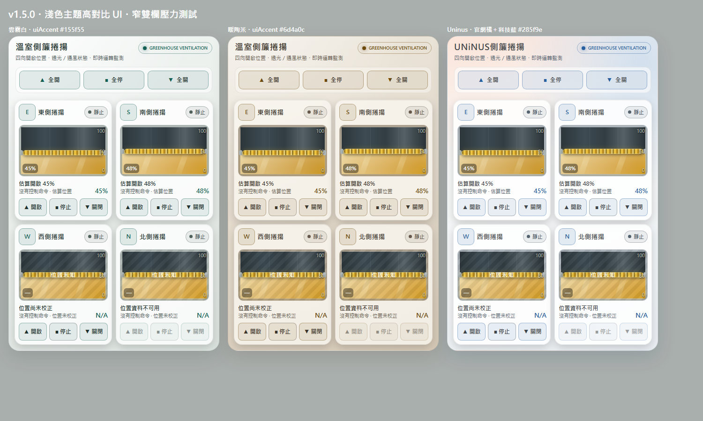

# UNiNUS Greenhouse Rollup Card

專為 Home Assistant 溫室側簾設計的獨立 Lovelace 卡片。可直接使用新版裝置提供的標準 MQTT `cover.*`，也可搭配 [UNiNUS Greenhouse Rollup Integration](https://github.com/ivanlee1007/uninus-greenhouse-rollup) 將舊版雙 Switch 包裝成具有位置估算與互鎖能力的 Cover。

[](https://hacs.xyz/) [](https://github.com/ivanlee1007/uninus-greenhouse-rollup-card/actions/workflows/ci.yml)



## 特色

- 同一卡片可使用原生 MQTT Cover 或 Integration 產生的 Cover。
- 原生 Cover 沒有 `current_position` 時明確顯示「位置未提供」，不會把 `open` 誤判為 `100%`。
- 依 `supported_features` 顯示開啟、停止與關閉按鈕。
- 顯示 Integration Cover 的估算位置、校正狀態、命令狀態與底層計時狀態。
- 可選顯示「全開／全停／全關」全域控制，一次操作卡片內所有可控制捲揚。
- 三個全域控制使用一致的操作色，方向由圖示與文字區分，不再混用開啟、捲動與靜止狀態色。
- 四面捲揚、動畫，以及低彩度霧面背景氛圍與完整視覺化設定。
- 可在設定 UI 選擇**每列捲揚數量** 1～4（最多 4 欄）或「自適應」；固定值維持指定欄數，自適應則依 Card 自身寬度安排 1～4 欄。
- 視力友善的響應式字體、方向 icon、狀態與控制尺寸會隨 Card 寬度及實際欄數同步調整，並保留可讀下限。
- 保留位置 Entity／Motion Entity 顯示模式，方便既有 Dashboard 逐步移轉。

## HACS 安裝

1. HACS → Frontend → 右上角選單 → Custom repositories。
2. Repository：`https://github.com/ivanlee1007/uninus-greenhouse-rollup-card`
3. Type：**Dashboard**。
4. 安裝 `UNiNUS Greenhouse Rollup Card`。
5. 重新整理瀏覽器。

HACS 會安裝 `uninus-greenhouse-rollup-card.js` 並自動加入 Lovelace 資源，不需要手動到「設定 → 儀表板 → 資源」新增 JavaScript Module。

> 從原本整合內建的卡片升級時，請先刪除舊的手動資源 `/uninus-greenhouse-rollup/uninus-greenhouse-rollup-card.js?...`，避免同一個 custom element 被載入兩次。

## 卡片設定

新增卡片時搜尋 **UNiNUS Greenhouse Rollup Card**，並使用視覺化設定；也可使用 YAML：

```yaml
type: custom:uninus-greenhouse-rollup-card
title: 溫室側簾捲揚
items_per_row: auto
show_global_controls: true
faces:
  - key: east
    name: 東側
    entity_mode: cover_entity
    cover_entity: cover.east_greenhouse_rollup
  - key: south
    name: 南側
    entity_mode: cover_entity
    cover_entity: cover.south_greenhouse_rollup
  - key: west
    name: 西側
    entity_mode: cover_entity
    cover_entity: cover.west_greenhouse_rollup
  - key: north
    name: 北側
    entity_mode: cover_entity
    cover_entity: cover.north_greenhouse_rollup
```

每一面設定 `cover_entity` 後，原生 Cover 與 Integration Cover 都使用標準 `cover.open_cover`、`cover.stop_cover`、`cover.close_cover` services。

### 每列捲揚數量

視覺化設定可選固定 `1～4` 欄，或選擇「自適應（依卡片寬度）」。YAML 使用：

```yaml
items_per_row: auto
```

自適應只讀取 Card 容器本身的寬度，不依賴整個瀏覽器或裝置螢幕寬度，因此同一個 Dashboard 中不同欄位的 Card 可以各自正確排列：

| Card 寬度 | 每列捲揚數量 |
|---|---:|
| `< 520px` | 1 |
| `520–819px` | 2 |
| `820–1119px` | 3 |
| `≥ 1120px` | 4 |

手機直向或其他窄卡會採單欄配置，單體及全域控制按鈕的觸控高度至少為 `44px`。手機橫向或較寬的 Dashboard 區塊可依實際 Card 寬度增加欄數。

既有 `items_per_row: 1`～`4` 會固定產生 1～4 欄，不會因寬度自動改變；未設定時預設仍為固定 2 欄，避免升級後改變現有版面。

### 視力友善字體與 icon 縮放

Card 會依容器寬度及目前實際欄數，套用有最小值與最大值的字體、方向 icon、狀態文字、位置資訊及控制按鈕尺寸。寬卡或較少欄數會放大；較多欄數會適度縮小，但不會無限制縮到難以閱讀。

| 每列欄數 | 捲揚名稱下限 | 方向 icon | 單體按鈕字體 | 單體按鈕高度 |
|---:|---:|---:|---:|---:|
| 1 欄 | 16px | 40px | 13px | 44px |
| 2 欄 | 14px | 34px | 12px | 38px |
| 3 欄 | 13px | 30px | 11px | 36px |
| 4 欄 | 12px | 28px | 11px | 34px |

Card 主標題會在 `18～24px` 間調整；副標題、狀態、估算位置、比例標示與全域控制也使用各自的可讀尺寸範圍。手機單欄仍維持至少 `44px` 的觸控目標。

高度會隨內容自然延展，不會因卡片變高或變矮而縮小字體；這可避免以自身高度反覆調整字體造成 ResizeObserver resize loop，也避免在矮卡中隱藏或截斷重要狀態。

### 全域控制

在視覺化設定的「版面與外觀」中啟用「顯示『全開／全停／全關』全域控制」，或在 YAML 設定：

```yaml
show_global_controls: true
```

- `全開`：對卡片內支援開啟的 Cover 呼叫 `cover.open_cover`。
- `全停`：對卡片內支援停止的 Cover 呼叫 `cover.stop_cover`。
- `全關`：對卡片內支援關閉的 Cover 呼叫 `cover.close_cover`。
- 全域操作只控制目前這張卡片 `faces` 中已設定、可用且支援該動作的 `cover.*`；不會搜尋或控制卡片之外的 Cover。
- 重複設定的相同 Entity 只會呼叫一次；不可用、未設定、唯讀或不支援該動作的 Entity 會略過。
- `show_global_controls` 預設為 `false`，升級既有卡片不會自行改變版面。
- `全開／全停／全關` 共用目前背景氛圍的高對比 UI 操作色；捲軸色只保留給捲軸與開啟場景，不再拿亮黃色顯示淺色背景上的小字或圖示。
- pending 與 disabled 仍以按鈕狀態呈現；disabled 控制使用 `opacity: .52`，保持停用辨識，同時避免在淺色背景上淡到看不見。

### 背景氛圍

四種既有的 `theme` YAML 值保持向後相容，另新增 `uninus`；五種背景共用低彩度、霧面農業控制台風格：

| YAML 值 | 視覺化設定名稱 | 氛圍 |
|---|---|---|
| `dark` | 深夜石墨 | 中性深灰、低眩光 |
| `light` | 雲霧白 | 柔和亮面；功能性 UI 使用高對比深青綠 `#155f55` |
| `greenhouse` | 森林深綠 | 克制的溫室綠、避免大片高飽和色 |
| `sand` | 暖陶米 | 低彩度暖米色；功能性 UI 使用高對比深陶棕 `#6d4a0c` |
| `uninus` | Uninus | 參考 [UNiNUS 公司官網](https://www.uninus.com.tw/)：珊瑚橘 `#ff8754` 光暈、科技藍 `#3074c1` 品牌層次，以及高對比 UI 藍 `#285f9e` |

五種氛圍共用相同的層次、表面透明度與局部光暈語言；切換主題只改變環境色調，不改變按鈕的操作語意。雲霧白、暖陶米與 Uninus 的方向 icon、百分比、右上角系統標示、運轉 badge、按鈕描邊與全域圖示均改用主題專屬高對比色；小字 token 會由自動化測試檢查至少 `4.5:1`。

```yaml
theme: uninus
```

### 新版：原生 MQTT Cover

新版智慧開關已由韌體／MQTT 處理方向並註冊標準 `cover.*` 時，卡片直接選擇該 Entity；不需要安裝後端 Integration。位置、運轉方向、availability 與控制能力皆以裝置實際回報為準。

### 舊版：雙 Switch Adapter

舊版裝置只有互斥的開啟與關閉 Switch 時，先安裝 [UNiNUS Greenhouse Rollup Integration](https://github.com/ivanlee1007/uninus-greenhouse-rollup)，為每一組捲揚建立標準 Cover，再於卡片選擇 Integration 產生的 `cover.*`。

Integration Cover 會額外提供：

- 估算位置與端點校正狀態；
- 實際位置積分中的開啟／關閉動畫；
- 「開啟命令中」或「關閉命令中」；
- 到端點後「已全開／已全關」，以及底層 switch 尚在計時的提示。

### 舊版 Entity 顯示模式

將 `entity_mode` 設為 `position_entity` 時，可延續舊版設定：

```yaml
type: custom:uninus-greenhouse-rollup-card
faces:
  - key: east
    name: 東側
    entity_mode: position_entity
    entity: input_number.up_lift_position_e
    motion_entity: binary_sensor.rollup_e_moving
    max_entity: input_number.rollup_e_maximum
    max_value: 120
```

此模式只顯示狀態，不提供 Integration 的位置保存、互鎖與開停關控制。

## 開發

```bash
npm install
npm test
npm run build
npm run check
```

建置輸出為 `uninus-greenhouse-rollup-card.js`。CI 會執行 JavaScript 測試、bundle 建置、語法檢查、HACS validation 與版本一致性檢查。

## License

MIT
